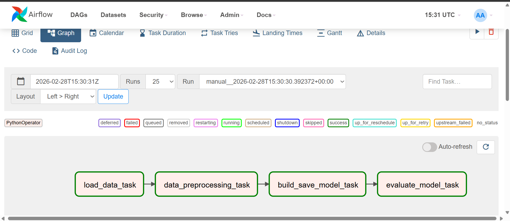

# Airflow Lab — Customer Churn Prediction

## ML Model

This script is designed for **customer churn prediction** using **Logistic Regression**. It provides functionality to generate/load sales data, perform preprocessing, train and save a Logistic Regression model, and evaluate it using accuracy score and a classification report.

### Prerequisites

Before using this script, make sure you have the following libraries installed:

- pandas
- scikit-learn (sklearn)
- numpy
- pickle

### Usage

```python
# Load the data
data = load_data()

# Preprocess the data
preprocessed_data = data_preprocessing(data)

# Build and save the model
eval_data = build_save_model(preprocessed_data, 'churn_model.pkl')

# Evaluate the model
result = evaluate_model('churn_model.pkl', eval_data)
print(result)
```

### Functions

1. **load_data()**
   - *Description:* Generates a synthetic sales/customer dataset (500 records) with features like age, annual spend, number of purchases, average order value, and days since last purchase. Serializes and returns the data.
   - *Usage:*
     ```python
     data = load_data()
     ```

2. **data_preprocessing(data)**
   - *Description:* Deserializes data, performs train/test split, applies StandardScaler on features, and returns serialized splits ready for model training.
   - *Usage:*
     ```python
     preprocessed_data = data_preprocessing(data)
     ```

3. **build_save_model(data, filename)**
   - *Description:* Trains a Logistic Regression model on the training data, saves it to a `.pkl` file, and returns serialized test data for evaluation.
   - *Usage:*
     ```python
     eval_data = build_save_model(preprocessed_data, 'churn_model.pkl')
     ```

4. **evaluate_model(filename, eval_data)**
   - *Description:* Loads the saved model, runs predictions on test data, and prints accuracy score, classification report, and feature coefficients.
   - *Usage:*
     ```python
     result = evaluate_model('churn_model.pkl', eval_data)
     ```

---

## Airflow Setup

Use Airflow to author workflows as directed acyclic graphs (DAGs) of tasks. The Airflow scheduler executes your tasks on an array of workers while following the specified dependencies.

**References**
- Product - https://airflow.apache.org/
- Documentation - https://airflow.apache.org/docs/
- Github - https://github.com/apache/airflow

### Installation

**Prerequisites:** You should allocate at least 4GB memory for the Docker Engine (ideally 8GB).

**Local**
- Docker Desktop Running

### Tutorial

1. Create and navigate to your project directory:
    ```bash
    mkdir -p ~/app
    cd ~/app
    ```

2. Running Airflow in Docker

    a. Check available memory:
    ```bash
    docker run --rm "debian:bullseye-slim" bash -c 'numfmt --to iec $(echo $(($(getconf _PHYS_PAGES) * $(getconf PAGE_SIZE))))'
    ```

    b. Fetch `docker-compose.yaml`:
    ```bash
    curl -LfO 'https://airflow.apache.org/docs/apache-airflow/2.5.1/docker-compose.yaml'
    ```

    c. Set up directories and Airflow user:
    ```bash
    mkdir -p ./dags ./logs ./plugins ./working_data
    echo -e "AIRFLOW_UID=$(id -u)" > .env
    ```

    d. Update the following in `docker-compose.yaml`:
    ```yaml
    # Disable example DAGs
    AIRFLOW__CORE__LOAD_EXAMPLES: 'false'

    # Required packages
    _PIP_ADDITIONAL_REQUIREMENTS: ${_PIP_ADDITIONAL_REQUIREMENTS:- pandas scikit-learn numpy}

    # PYTHONPATH so src/ is importable inside containers
    PYTHONPATH: /opt/airflow

    # Mount src/ and working_data/
    - ${AIRFLOW_PROJ_DIR:-.}/src:/opt/airflow/src
    - ${AIRFLOW_PROJ_DIR:-.}/working_data:/opt/airflow/working_data

    # Updated credentials
    _AIRFLOW_WWW_USER_USERNAME: ${_AIRFLOW_WWW_USER_USERNAME:-airflow2}
    _AIRFLOW_WWW_USER_PASSWORD: ${_AIRFLOW_WWW_USER_PASSWORD:-airflow2}
    ```

    e. Initialize the database:
    ```bash
    docker compose up airflow-init
    ```

    f. Start Airflow:
    ```bash
    docker compose up
    ```

    Wait until terminal outputs:

    `airflow-webserver-1 | 127.0.0.1 - - "GET /health HTTP/1.1" 200 141`

    g. Visit `http://localhost:8080` and log in with credentials set in step `2.d`

3. Explore UI and add user via `Security > List Users`

4. Trigger the DAG `sales_churn_prediction` and monitor all 4 tasks in Graph view

5. Stop containers when done:
    ```bash
    docker compose down
    ```

---

## Airflow DAG — `sales_churn_prediction`

### DAG Overview

The DAG `sales_churn_prediction` consists of 4 tasks representing a complete ML pipeline for predicting customer churn from sales data.

### Task Dependencies

```
load_data_task >> data_preprocessing_task >> build_save_model_task >> evaluate_model_task
```

### Task Descriptions

- **load_data_task** — Generates synthetic customer sales data and serializes it for downstream tasks.
- **data_preprocessing_task** — Scales features and splits data into train/test sets using `StandardScaler`.
- **build_save_model_task** — Trains a `LogisticRegression` model and saves it to `/opt/airflow/working_data/churn_model.pkl`.
- **evaluate_model_task** — Loads the saved model and outputs accuracy, classification report, and feature coefficients.

### DAG Output



---

## Directory Structure

```
Airflow_Labs/
├── dags/
│   ├── airflow.py          # DAG definition
│   └── data/
│       └── DAG_Output.png  # Screenshot of successful DAG run
├── src/
│   ├── __init__.py
│   └── lab.py              # ML pipeline functions
├── working_data/           # Saved model artifacts (churn_model.pkl)
├── docker-compose.yaml
├── setup.sh
└── README.md
```
