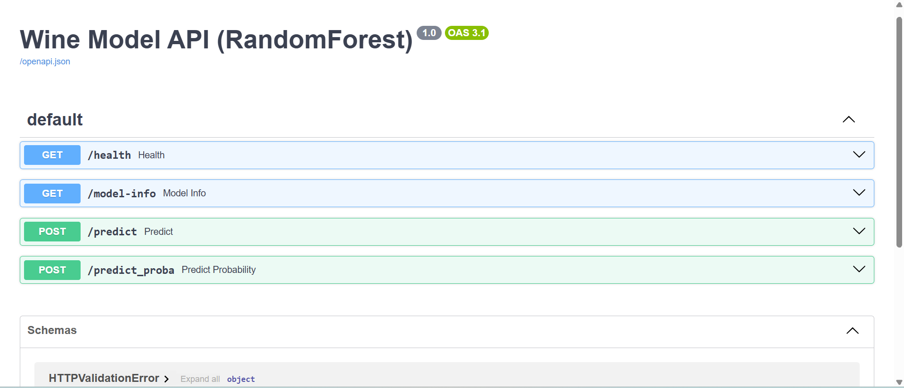
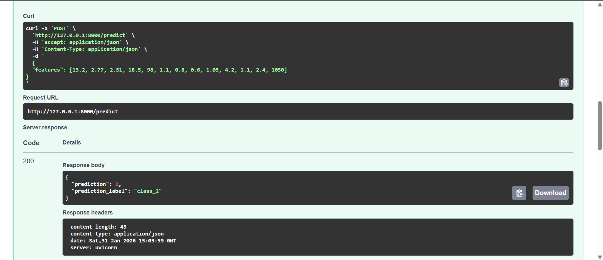
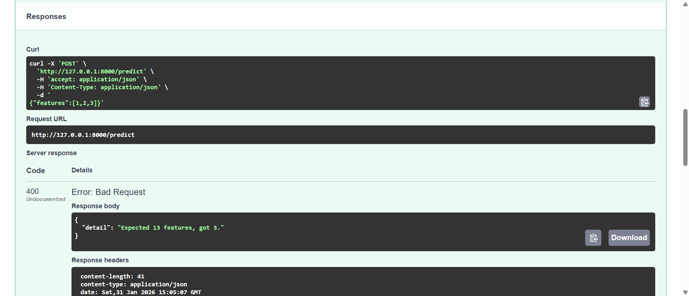

# Wine Model API (FastAPI + RandomForest)

This lab demonstrates how to expose a trained machine learning model as a REST API using **FastAPI** and **Uvicorn**.


## Project Structure
```
fastapi_lab1/
├── assets/
├── model/
│   ├── wine_model.pkl
│   └── metadata.json
├── src/
│   ├── data.py
│   ├── main.py
│   ├── predict.py
│   └── train.py
├── requirements.txt
└── README.md
```

---

## Setup

### 1) Create and activate a virtual environment

**Windows (PowerShell):**
```bash
python -m venv fastapi_lab1_env
fastapi_lab1_env\Scripts\activate
```

**macOS / Linux:**
```bash
python -m venv fastapi_lab1_env
source fastapi_lab1_env/bin/activate
```

### 2) Install dependencies
```bash
pip install -r requirements.txt
```

---

## Train the Model

From the project root:
```bash
cd src
python train.py
```

This generates:
- `model/wine_model.pkl`
- `model/metadata.json`

---

## Run the API

From `src/`:
```bash
uvicorn main:app --reload
```

Open Swagger UI:  
**http://127.0.0.1:8000/docs**

---

## Endpoints

### `GET /health`
Quick server check.

**Response:**
```json
{"status": "ok"}
```

---

### `GET /model-info`
Returns model and dataset metadata (including test accuracy).

---

### `POST /predict`
Predicts the wine class.

**Request:**
```json
{
  "features": [13.2, 2.77, 2.51, 18.5, 98, 1.1, 0.8, 0.6, 1.05, 4.2, 1.1, 2.4, 1050]
}
```

**Response:**
```json
{
  "prediction": 0,
  "prediction_label": "class_0"
}
```

---

### `POST /predict_proba`
Returns class probabilities (RandomForest supports `predict_proba`).

---

## API Screenshots

### Swagger UI


### Model Metadata Endpoint


### Prediction Example


### Input Validation Example


## Notes

- The Wine dataset expects **13 numeric features** in the exact order shown in `/model-info` under `feature_names`.
- If you get "model not found", retrain using `python train.py`.